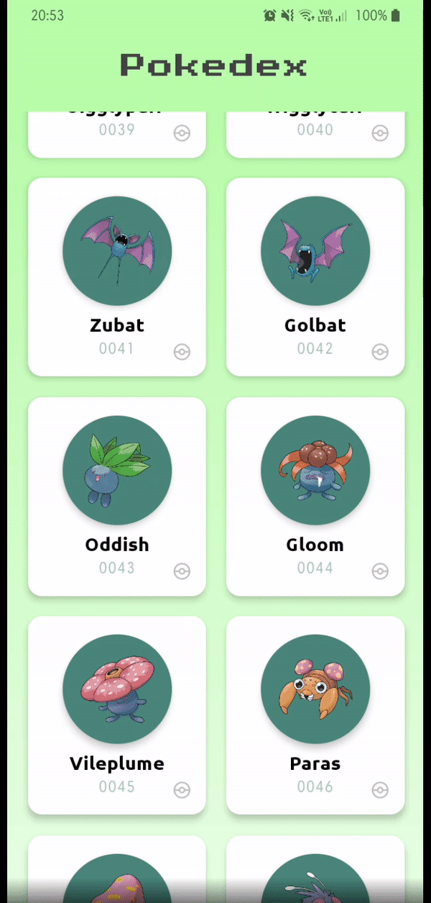

<h1 align="center">
  Pokédex
</h1>

## Table of contents:

- [About the project](#about-the-project)
- [Technologies](#technologies)
- [Prerequisites](#prerequisites)
- [Getting started](#getting-started)
- [File structure](#file-structure)
- [License](#license)
- [Contact](#contact)

## About the project:

<div>
  
  
</div>

Pokedex developed with React Native, consuming the public API: [Pokeapi](https://pokeapi.co/docs/v2).

Objective:
- Consume the endpoint https://pokeapi.co/api/v2/pokemon/ and create a screen with a list of pokemons using pagination.
- Consume the endpoint https://pokeapi.co/api/v2/pokemon/{id or name}/ and create a pokemon details screen.

## Technologies

:white_check_mark: React Native\
:white_check_mark: Native Base\
:white_check_mark: Styled-components\
:white_check_mark: Axios\
:white_check_mark: React-native-linear-gradient\
:white_check_mark: SWR\
:white_check_mark: React-navigation\
:white_check_mark: Context API\
:white_check_mark: Lottie\
:white_check_mark: Git-commit-msg-linter\
:white_check_mark: React-native-animatable\
:white_check_mark: React Hooks\
:white_check_mark: Babel-plugin-root-import\
:white_check_mark: Vector Icons\
:white_check_mark: Animated\
:white_check_mark: Typescript


## Prerequisites

Before proceeding, it is ideal that you have the environment set up to create applications in React Native, for this you can follow the guide of the link below:

[React Native's Environment (Android/iOS)](https://reactnative.dev/docs/environment-setup)

## Getting started

#### First you clone the project:

```bash
$ git clone https://github.com/MRLSK8/Pokedex.git && cd Pokedex
```

#### Then you run the following command to install packages:

```bash
$ yarn install
```

#### Next, you start the project:

```bash
$ yarn start
```

#### Finally you run it like so:

```bash
$ yarn android
```

#### If you want to build it and generate an APK just do the following

```bash
$ yarn android:build
```

#### It will generate an APK on android/app/build/outputs/apk/app-release.apk, copy into your cellphone and install it.
#### And that's it!


## File structure

The file structure are in the following way:

```bash
├── src/
│   ├── @types/
│   │   └── index.d.js
│   ├── assets/
│   │   └── LottieJsonFiles
│   │       ├── pikachu.json
|   |       └── pokeball.json
│   ├── components/
│   │   ├── GoBackButton/
|   |   |   ├── index.tsx
|   |   |   └── style.ts
|   |   ├── LoadingWrapper/ 
|   |   |   ├── index.tsx
|   |   |   └── style.ts
│   │   ├── PokemonItem/
|   |   |   ├── index.tsx
|   |   |   └── style.ts
|   |   ├── SafeAreaWrapper/ 
|   |   |   ├── index.tsx
|   |   |   └── style.ts
│   │   └── index.ts
│   ├── config/
│   │   └── statusBarConfig.ts
│   ├── hooks/
│   │   └── pokemonContext.tsx
│   ├── routes/
│   │   └── index.ts
│   ├── screens/
│   │   ├── PokemonDetails/
|   |   |   ├── index.tsx
|   |   |   └── style.ts
|   |   ├── PokemonsList/ 
|   |   |   ├── index.tsx
|   |   |   └── style.ts
│   │   └── index.tsx
│   ├── services/
│   │   └── api.ts
│   ├── utils/
│   │   ├── addPadLeftToNumber.ts
│   │   ├── getPokemonIdByUrl.ts
│   │   ├── getPokemonImageById.ts
│   │   ├── index.ts
│   │   └── showErrorAlert.ts
│   ├── index.tsx
├── .buckconfig
├── .editorconfig
├── .eslintrc.js
├── .eslintrc.json
├── .gitattributes
├── .gitignore
├── .prettierrc.js
├── .watchmanconfig
├──  app.json
├── babel.config.js
├── index.js
├── LICENSE
├── metro.config
├── package.json
├── react-native.config.js
├── tsconfig.js
├── yarn.lock
```

## License:

This project is licensed under the MIT License - see the [LICENSE](LICENSE) file for details.


## Contact:

[Facebook](https://www.facebook.com/profile.php?id=100004301021977 'My facebook')  |  [Instagram](https://www.instagram.com/mrlsk8/ 'My instagram')  |  [Linkedin](https://www.linkedin.com/in/mrlsk8/ 'My linkedin')

<div align="center">
  Made with :heart: by <strong>Marcelo Lima</strong> 😊
</div>
